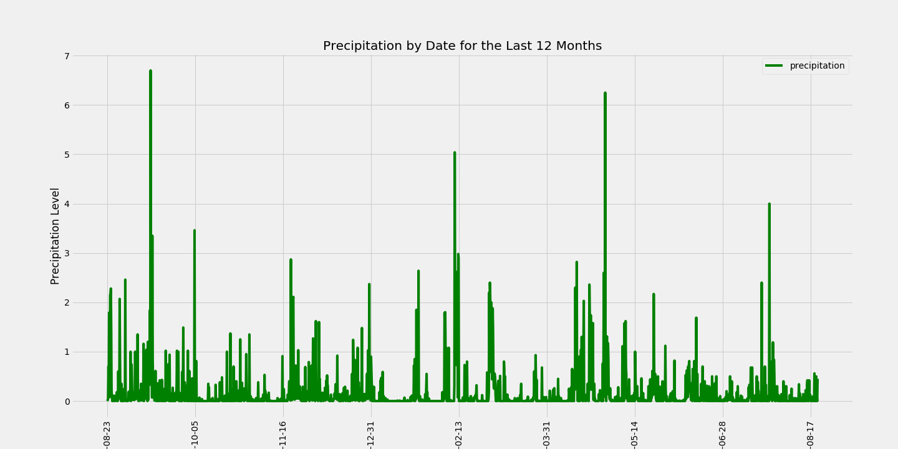

# SQLAlchemy Hawaii Vacation  

This assignment was to analyse data using SQLAlchemy ORM queries, Python, Pandas and Matplotllib.   SQLAlchemy was used to connect to sqlite database with the tables of Hawaii climate data. 

A Flask API app was used to create routes that retrieve JSON data such as precipitation values by date, stations, temperature observations from the last year, and min, max, and average temperatures within a specified date range.

Additionally, to perform the analyse of Hawaii climate dataset,  these were done: 
  1. SQLAlchemy was used to reflect existing databases to classes in Python
  2. Queries were used to retrieve the last 12 months of precipitation data and plotting them over time using a pandas DataFrame
  3. Queries were designed to obtain the total number of stations, the most active stations, and the last 12 months of temperature observation data (summarized as a histogram)

